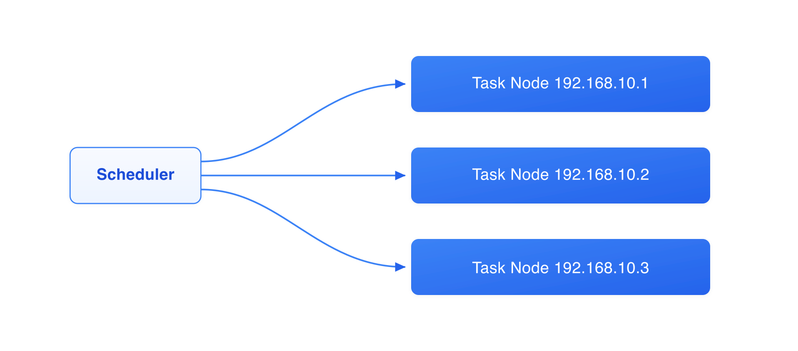

# gocron - Distributed scheduled Task Scheduler

[](https://github.com/gocronx-team/gocron/releases) [](https://github.com/gocronx-team/gocron/releases) [](https://github.com/gocronx-team/gocron/blob/master/LICENSE)

English | [简体中文](README_ZH.md)

A lightweight distributed scheduled task management system developed in Go, designed to replace Linux-crontab.

## 📖 Documentation

Full documentation is available at: **[document](https://gocron-docs.pages.dev/en/)**

- 🚀 [Quick Start](https://gocron-docs.pages.dev/en/guide/quick-start) - Installation and deployment guide
- 🤖 [Agent Auto-Registration](https://gocron-docs.pages.dev/en/guide/agent-registration) - One-click task node deployment
- ⚙️ [Configuration](https://gocron-docs.pages.dev/en/guide/configuration) - Detailed configuration guide
- 🔌 [API Documentation](https://gocron-docs.pages.dev/en/guide/api) - API reference

## ✨ Features

- **Web Interface**: Intuitive task management interface
- **Second-level Precision**: Supports Crontab expressions with second precision
- **High Availability**: Database-lock-based leader election, automatic failover in seconds
- **Task Retry**: Configurable retry policies for failed tasks
- **Task Dependency**: Supports task dependency configuration
- **Access Control**: Comprehensive user and permission management
- **2FA Security**: Two-Factor Authentication support
- **Agent Auto-Registration**: One-click installation for Linux/macOS
- **MCP Support**: Remote management by AI clients (Claude Desktop, Cursor, etc.) via the Model Context Protocol, secured with web-managed access tokens
- **AI Assist**: Natural-language to cron expression, AI-powered failure-log diagnosis, and an in-app AI ops chat assistant (query tasks/logs/hosts/templates, diagnose failures), backed by any OpenAI-compatible model (configurable endpoint, also works with self-hosted/local models)
- **Multi-Database**: MySQL / PostgreSQL / SQLite support
- **Container-Aware Memory**: Automatically sets `GOMEMLIMIT` from the container's cgroup memory limit to reduce OOM kills in Docker/Kubernetes
- **Real-Time Task Output**: Stream Shell (RPC) stdout/stderr in the Execution Output dialog while a job is running, with reconnect catch-up and acknowledged cancellation
- **Log Management**: Complete execution logs with auto-cleanup; live output is redacted, size-limited, and persisted efficiently across MySQL / PostgreSQL / SQLite
- **Notifications**: Email, Slack, Webhook support

## 🚀 Quick Start

The fastest way to try gocron is Docker Compose (builds the image from source locally):

```bash
# 1. Clone the project
git clone https://github.com/gocronx-team/gocron.git
cd gocron

# 2. Start services
docker compose up -d

# 3. Access Web Interface
# http://localhost:5920
```

> For production, binary deployment is recommended. See the [Installation Guide](https://gocron-docs.pages.dev/en/guide/quick-start) for all methods (Binary, Docker, Kubernetes, Development).

## 🔷 High Availability (Optional)

Deploy multiple gocron instances pointing to the same **MySQL/PostgreSQL** database. Leader election is automatic — no extra configuration needed. SQLite runs in single-node mode.

```bash
# Node 1
./gocron web --port 5920

# Node 2 (same database)
./gocron web --port 5921
```

See the [High Availability Guide](https://gocron-docs.pages.dev/en/guide/high-availability) for setup details, K8s deployment, and environment variable overrides.

## 📸 Screenshots

<p align="center">
  <b>Scheduled Tasks</b><br>
  
</p>

<table>
  <tr>
    <td width="50%" align="center"><b>Agent Auto-Registration</b></td>
    <td width="50%" align="center"><b>Task Management</b></td>
  </tr>
  <tr>
    <td></td>
    <td></td>
  </tr>
</table>

<p align="center">
  <b>AI Failure Diagnosis</b><br>
  
</p>

## 🤝 Contributing

Contributions are welcome! See [CONTRIBUTING.md](CONTRIBUTING.md) for the full guide.

One thing to note: commit messages are validated by a git hook
([commitlint](https://github.com/conventional-changelog/commitlint)), so use the
interactive commit tool instead of `git commit`:

```bash
pnpm install      # first-time setup (installs git hooks)
pnpm run commit   # create a properly formatted commit
```

## 📄 License

This project is licensed under the MIT License. See the [LICENSE](LICENSE) file for details.
