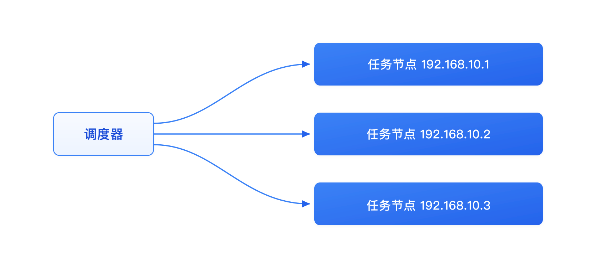

# gocron - 分布式定时任务调度系统

[](https://github.com/gocronx-team/gocron/releases) [](https://github.com/gocronx-team/gocron/releases) [](https://github.com/gocronx-team/gocron/blob/master/LICENSE)

[English](README.md) | 简体中文

使用 Go 语言开发的轻量级分布式定时任务集中调度和管理系统，用于替代 Linux-crontab。

## 📖 文档

访问完整文档请跳转：[文档](https://gocron-docs.pages.dev/zh/)

- 🚀 [快速开始](https://gocron-docs.pages.dev/zh/guide/quick-start) - 安装部署指南
- 🤖 [Agent 自动注册](https://gocron-docs.pages.dev/zh/guide/agent-registration) - 一键部署任务节点
- ⚙️ [配置文件](https://gocron-docs.pages.dev/zh/guide/configuration) - 详细配置说明
- 🔌 [API 文档](https://gocron-docs.pages.dev/zh/guide/api) - API 接口说明

## ✨ 功能特性

- **Web 界面管理**：直观的定时任务管理界面
- **秒级定时**：支持 Crontab 时间表达式，精确到秒
- **高可用**：基于数据库锁的 Leader 选举，秒级自动故障转移
- **任务重试**：支持任务执行失败重试设置
- **任务依赖**：支持配置任务依赖关系
- **多用户权限**：完善的用户和权限控制
- **双因素认证**：支持 2FA，提升系统安全性
- **Agent 自动注册**：支持 Linux/macOS 一键安装注册
- **MCP 支持**：AI 客户端（Claude Desktop、Cursor 等）可通过 Model Context Protocol 远程管理任务，使用 Web 端管理的访问令牌鉴权
- **AI 辅助**：自然语言转 cron 表达式、失败日志 AI 诊断、产品内 AI 运维助手对话（查询任务/日志/节点/模板、诊断失败），对接任意 OpenAI 兼容模型（接入地址可配置，亦支持自建/本地模型）
- **多数据库支持**：MySQL / PostgreSQL / SQLite
- **容器内存感知**：自动根据容器 cgroup 内存上限设置 `GOMEMLIMIT`，减少 Docker/Kubernetes 下被 OOM kill
- **任务实时输出**：Shell（RPC）任务运行期间可在 Execution Output 弹窗实时查看 stdout/stderr，支持断线续传和节点确认的停止操作
- **日志管理**：完整的任务执行日志，支持自动清理；实时输出经过脱敏、大小限制，并针对 MySQL / PostgreSQL / SQLite 高效持久化
- **消息通知**：支持邮件、Slack、Webhook 等多种通知方式

## 🚀 快速开始

想快速体验，用 Docker Compose 最快（会在本地从源码构建镜像）：

```bash
# 1. 克隆项目
git clone https://github.com/gocronx-team/gocron.git
cd gocron

# 2. 启动服务
docker compose up -d

# 3. 访问 Web 界面
# http://localhost:5920
```

> 生产环境推荐使用二进制部署。各部署方式（二进制、Docker、Kubernetes、开发环境）详见 [安装部署指南](https://gocron-docs.pages.dev/zh/guide/quick-start)。

## 🔷 高可用部署（可选）

多个 gocron 实例连接同一个 **MySQL/PostgreSQL** 数据库即可实现高可用，Leader 选举自动完成，无需额外配置。SQLite 以单节点模式运行。

```bash
# 节点 1
./gocron web --port 5920

# 节点 2（连接同一数据库）
./gocron web --port 5921
```

详细部署步骤、K8s 配置和环境变量覆盖请参考 [高可用部署指南](https://gocron-docs.pages.dev/zh/guide/high-availability)。

## 📸 界面截图

<p align="center">
  <b>任务调度</b><br>
  
</p>

<table>
  <tr>
    <td width="50%" align="center"><b>Agent自动注册</b></td>
    <td width="50%" align="center"><b>任务管理</b></td>
  </tr>
  <tr>
    <td></td>
    <td></td>
  </tr>
</table>

<p align="center">
  <b>AI 失败诊断</b><br>
  
</p>

## 🤝 贡献

欢迎社区贡献！完整指南见 [CONTRIBUTING.md](CONTRIBUTING.md)。

需要注意：提交信息由 git 钩子（[commitlint](https://github.com/conventional-changelog/commitlint)）
强制校验，请用交互式提交工具代替 `git commit`：

```bash
pnpm install      # 首次准备（会装好 git 钩子）
pnpm run commit   # 生成规范的提交信息
```

## 📄 许可证

本项目遵循 MIT 许可证。详情请见 [LICENSE](LICENSE) 文件。
